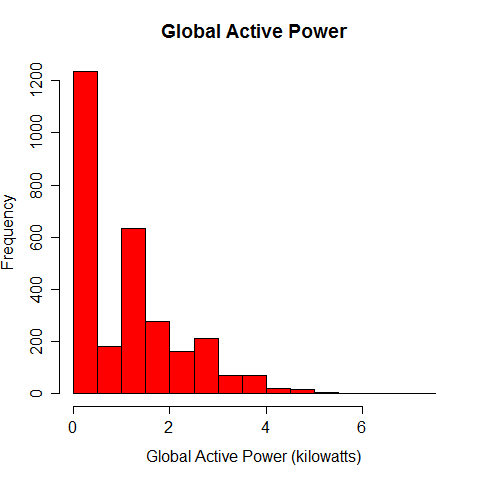
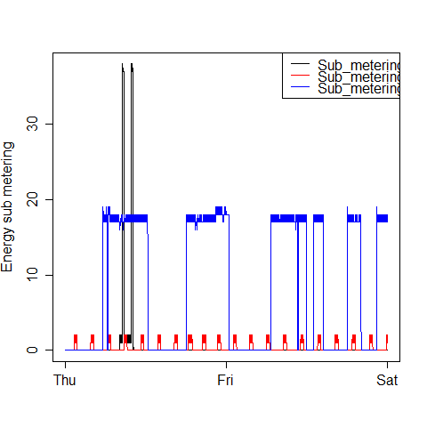
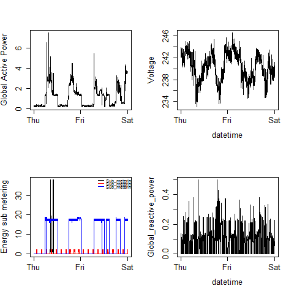

# Plotting Power Consumption
Srihari Jala
May 7, 2016

###About
This was the first project for the **Exploratory Data Analysis** course in Coursera's Data Science specialization track. 


##Sypnosis
Overall goal here is to examine how household energy usage varies over a 2-day period in February, 2007. The task is to reconstruct the four plots using the base plotting system.

##Data
This project used data from the [UC Irvine Machine Learning Repository](http://archive.ics.uci.edu/ml/), a popular repository for machine learning datasets. 
The "Individual household electric power consumption Data Set" was used and made available on the course web site:

* [Electric power consumption Dataset (20Mb)](https://d396qusza40orc.cloudfront.net/exdata%2Fdata%2Fhousehold_power_consumption.zip)
					      
* Description: Measurements of electric power consumption in
one household with a one-minute sampling rate over a period of almost
4 years. Different electrical quantities and some sub-metering values
are available.

The following descriptions of the 9 variables in the dataset are taken
from the [UCI web site](https://archive.ics.uci.edu/ml/datasets/Individual+household+electric+power+consumption)

<ol>
<li><b>Date</b>: Date in format dd/mm/yyyy </li>
<li><b>Time</b>: time in format hh:mm:ss </li>
<li><b>Global_active_power</b>: household global minute-averaged active power (in kilowatt) </li>
<li><b>Global_reactive_power</b>: household global minute-averaged reactive power (in kilowatt) </li>
<li><b>Voltage</b>: minute-averaged voltage (in volt) </li>
<li><b>Global_intensity</b>: household global minute-averaged current intensity (in ampere) </li>
<li><b>Sub_metering_1</b>: energy sub-metering No. 1 (in watt-hour of active energy). It corresponds to the kitchen, containing mainly a dishwasher, an oven and a microwave (hot plates are not electric but gas powered). </li>
<li><b>Sub_metering_2</b>: energy sub-metering No. 2 (in watt-hour of active energy). It corresponds to the laundry room, containing a washing-machine, a tumble-drier, a refrigerator and a light. </li>
<li><b>Sub_metering_3</b>: energy sub-metering No. 3 (in watt-hour of active energy). It corresponds to an electric water-heater and an air-conditioner.</li>
</ol>

##Data Loading and Preprocessing

```r
if(!file.exists("household_power_consumption.txt")) {
        temp <- tempfile()
        download.file("http://d396qusza40orc.cloudfront.net/exdata%2Fdata%2Fhousehold_power_consumption.zip",temp)
        file <- unzip(temp)
        unlink(temp)
}

```

##My Plot 1

```r
source("data-download.R")

plot1 <- function(file) {
        power <- read.table(file, header=T, sep=";")
        power$Date <- as.Date(power$Date, format="%d/%m/%Y")
        
        df <- power[(power$Date=="2007-02-01") | (power$Date=="2007-02-02"),]
        
        df$Global_active_power <- as.numeric(as.character(df$Global_active_power))
        
        hist(df$Global_active_power, main = paste("Global Active Power"), col="red", xlab="Global Active Power (kilowatts)")
        
        dev.copy(png, file="plot1.png", width=480, height=480)
        dev.off()
        cat("Plot1.png has been saved in", getwd())
}

plot1("household_power_consumption.txt")
```

 


##My Plot 2

```r
source("data-download.R")

plot2 <- function(file) {
        power <- read.table(file, header=T, sep=";")
        power$Date <- as.Date(power$Date, format="%d/%m/%Y")
        df <- power[(power$Date=="2007-02-01") | (power$Date=="2007-02-02"),]
        
        df$Global_active_power <- as.numeric(as.character(df$Global_active_power))
        df <- transform(df, timestamp=as.POSIXct(paste(Date, Time)), "%d/%m/%Y %H:%M:%S")
        
        plot(df$timestamp,df$Global_active_power, type="l", xlab="", ylab="Global Active Power (kilowatts)")
        
        dev.copy(png, file="plot2.png", width=480, height=480)
        dev.off()
        cat("plot2.png has been saved in", getwd())
}


plot2("household_power_consumption.txt")

```
 

##My Plot 3

```r
source("data-download.R")

plot3 <- function(file) {
        power <- read.table(file, header=T, sep=";")
        power$Date <- as.Date(power$Date, format="%d/%m/%Y")
        df <- power[(power$Date=="2007-02-01") | (power$Date=="2007-02-02"),]
        
        df$Sub_metering_1 <- as.numeric(as.character(df$Sub_metering_1))
        df$Sub_metering_2 <- as.numeric(as.character(df$Sub_metering_2))
        df$Sub_metering_3 <- as.numeric(as.character(df$Sub_metering_3))
        
        df <- transform(df, timestamp=as.POSIXct(paste(Date, Time)), "%d/%m/%Y %H:%M:%S")
        
        plot(df$timestamp,df$Sub_metering_1, type="l", xlab="", ylab="Energy sub metering")
        lines(df$timestamp,df$Sub_metering_2,col="red")
        lines(df$timestamp,df$Sub_metering_3,col="blue")
        legend("topright", col=c("black","red","blue"), c("Sub_metering_1  ","Sub_metering_2  ", "Sub_metering_3  "),lty=c(1,1), lwd=c(1,1))
        dev.copy(png, file="plot3.png", width=480, height=480)
        dev.off()
        cat("plot3.png has been saved in", getwd())
}

plot3("household_power_consumption.txt")
```
 

##My Plot 4

```r
source("data-download.R")

plot4 <- function(file) {
        power <- read.table(file, header=T, sep=";")
        power$Date <- as.Date(power$Date, format="%d/%m/%Y")
        df <- power[(power$Date=="2007-02-01") | (power$Date=="2007-02-02"),]
        
        df$Sub_metering_1 <- as.numeric(as.character(df$Sub_metering_1))
        df$Sub_metering_2 <- as.numeric(as.character(df$Sub_metering_2))
        df$Sub_metering_3 <- as.numeric(as.character(df$Sub_metering_3))
        df$Global_active_power <- as.numeric(as.character(df$Global_active_power))
        df$Global_reactive_power <- as.numeric(as.character(df$Global_reactive_power))
        df$Voltage <- as.numeric(as.character(df$Voltage))
        
        df <- transform(df, timestamp=as.POSIXct(paste(Date, Time)), "%d/%m/%Y %H:%M:%S")
        
        par(mfrow=c(2,2))
        
        ##PLOT 1
        plot(df$timestamp,df$Global_active_power, type="l", xlab="", ylab="Global Active Power")
        
        ##PLOT 2
        plot(df$timestamp,df$Voltage, type="l", xlab="datetime", ylab="Voltage")
        
        ##PLOT 3
        plot(df$timestamp,df$Sub_metering_1, type="l", xlab="", ylab="Energy sub metering")
        lines(df$timestamp,df$Sub_metering_2,col="red")
        lines(df$timestamp,df$Sub_metering_3,col="blue")
        legend("topright", col=c("black","red","blue"), c("Sub_metering_1  ","Sub_metering_2  ", "Sub_metering_3  "),lty=c(1,1), bty="n", cex=.5) #bty removes the box, cex shrinks the text, spacing added after labels so it renders correctly
        
        #PLOT 4
        plot(df$timestamp,df$Global_reactive_power, type="l", xlab="datetime", ylab="Global_reactive_power")
        
        
        dev.copy(png, file="plot4.png", width=480, height=480)
        dev.off()
        cat("plot4.png has been saved in", getwd())
}

plot4("household_power_consumption.txt")
```
 


